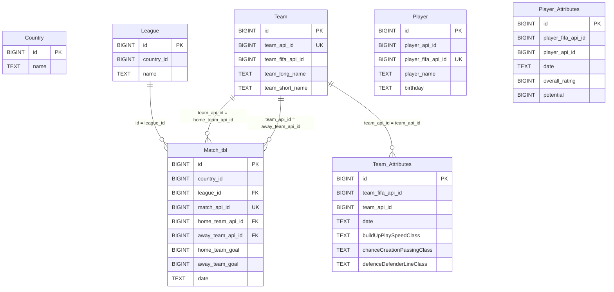

# Soccer Project ER Diagram (`soccer_proj`)

Use this Mermaid ERD in your Deliverable 2 doc (or export screenshot from a Mermaid preview).

## Notes for Deliverable 2 text

- Enforced foreign keys are shown as solid relationships in the diagram.
- Some source relationships were left as logical-only due orphan values in source data during migration.
