# Deliverable 4 Presentation — Deep Dive (Easy-to-Read Guide)

**Author:** Emmanuel Arthur (emmanart)  
**For:** Anyone presenting the 8-minute video (written at about 11th–12th grade reading level)  
**Deck:** `Deliverable4_Presentation-emmanart.pptx`  
**Database schema:** `soccer_proj` on PostgreSQL (tool: DBeaver)

---

## How to use this document

Your PowerPoint is the **short version** you show on screen. This file is the **long version** that explains **every slide** in plain language, with **pictures (diagrams)** so you understand *why* each bullet is there—not just what it says.

**Tip:** Read one slide section, then open the matching slide in PowerPoint and practice out loud.

---

## Big picture: what is this project?

Think of a database like a **filing system** for soccer data:

- **Tables** = spreadsheets with one topic each (teams, matches, countries).
- **Rows** = one record (one game, one team, one player).
- **Columns** = facts about that record (goals, date, name).
- **Schema** (`soccer_proj`) = a **folder** that holds all your soccer tables together, separate from other class data (like homework `spy`).

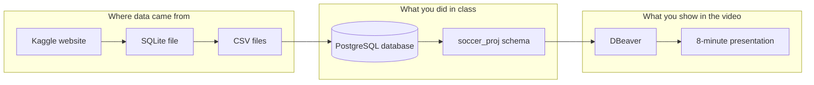

---

# Slide 1 — Title: European Soccer Database

## What you see on the slide

| On screen | Plain English |
|-----------|----------------|
| Green bar: **European Soccer Database** | The name of your dataset (European club soccer from Kaggle). |
| **Final Project · Deliverable 4 · soccer_proj** | Last big assignment; data lives in schema `soccer_proj`. |
| **Emmanuel Arthur · Database Class · Spring 2026** | Who you are and which course. |

## Diagram: parts of the title

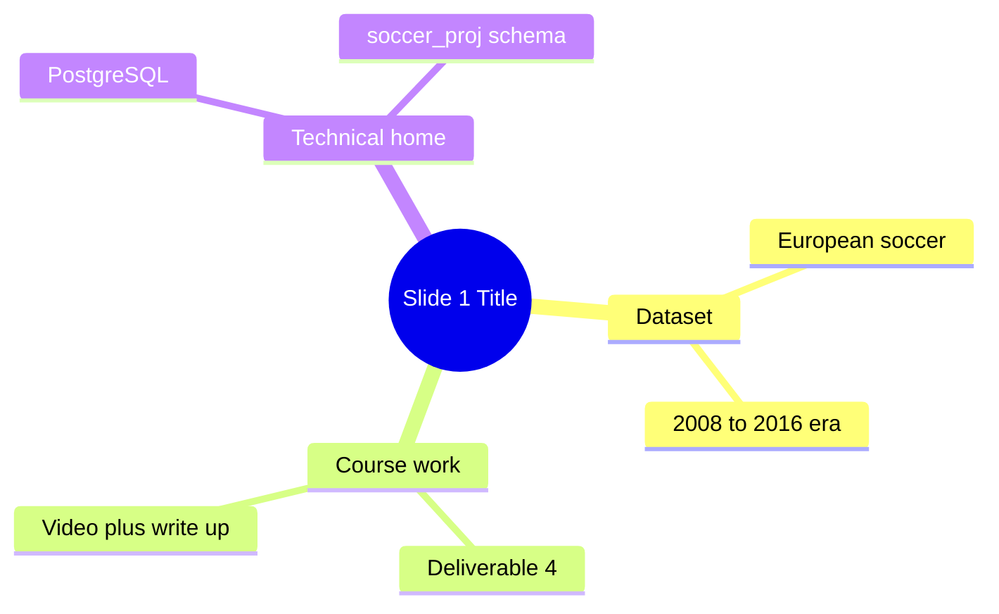

## Deeper explanation

**Why “European Soccer Database”?**  
You did not invent random numbers. You used a public dataset that already had real matches, teams, and players. That makes your project believable—like a small version of what sports companies use.

**What is `soccer_proj`?**  
In PostgreSQL, a **schema** is like a labeled drawer in a filing cabinet. Your drawer is named `soccer_proj`. Inside it are tables `Country`, `League`, `Match_tbl`, etc. When you write SQL, you often start with `soccer_proj."Match_tbl"` so the computer knows *which drawer* to open.

**Why your name matters**  
The assignment requires the grader to know who spoke. In a team project, everyone must appear on camera. You are solo, so you introduce yourself once here.

## What to say (~30 seconds)

> “Hi, I’m Emmanuel Arthur. This is my final database project on the European Soccer Database. I loaded it into PostgreSQL under the schema soccer_proj. In this video I’ll explain the design, what I learned, and two SQL demos.”

---

# Slide 2 — Dataset overview

## Bullets on the slide (simplified)

1. Data started on Kaggle, moved through SQLite and CSV, ended in PostgreSQL.  
2. About **11 countries**, **11 leagues**, **~26,000 matches** from **2008–2016**, plus teams and players.  
3. Real businesses use this *kind* of data for reports—not just for class.  
4. **7 main tables** plus **views** (saved queries).  
5. **222,796** total rows if you add up every table.

## Diagram: from download to database

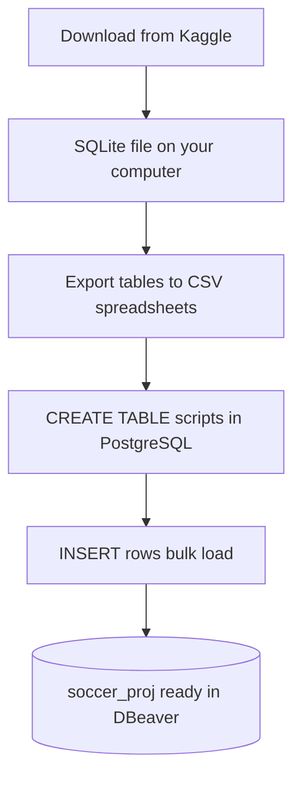

**Why so many steps?**  
Each step converts data into a stricter format. PostgreSQL is picky (good thing): it rejects bad dates and wrong types instead of silently breaking your averages later.

## What each number means (like a sports fan)

| Number | Real-world meaning |
|--------|-------------------|
| 11 countries | England, Spain, Germany, etc.—the “where.” |
| 11 leagues | Usually one top league per country in this dataset (Premier League, La Liga, …). |
| ~26,000 matches | Each row is **one game** with scores, date, and extra stats. |
| 222,796 rows total | Includes **player skill snapshots** over many dates (big table `Player_Attributes`). |

## Diagram: how tables relate (simple)

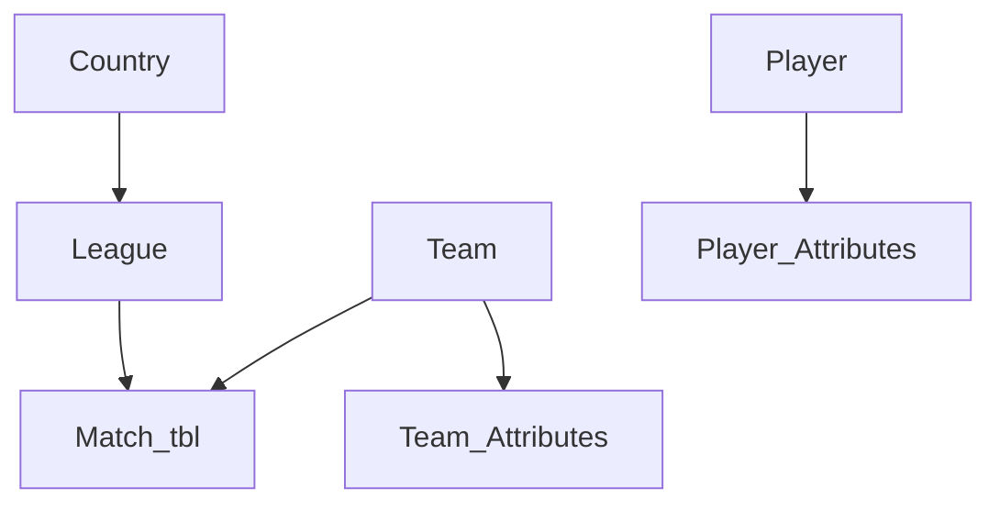

- **Country / League / Match_tbl** = where and when games happened.  
- **Team** = clubs (Barcelona, Celtic, …).  
- **Player** + **Attributes** = how good a player was on different dates (like report cards over time).

## Business context (why this slide exists)

A **database is not a spreadsheet dump**. Companies ask questions like:

- “Which league scores the most?”  
- “Which team defends best?”  

Your project proves you can **store** data cleanly and **answer** those questions with SQL.

## What to say (~1 minute)

Walk the pipeline diagram in words: Kaggle → load → PostgreSQL. Give the scope numbers. End with: “This is the same shape of data analysts use for sports media and club stats.”

---

# Slide 3 — Why I chose this dataset

## Bullets on the slide

1. You care about soccer (Man United, Bayern Munich).  
2. You already understand home/away, seasons, clean sheets.  
3. You can ask **business-style** questions (scoring, defense, player growth).  
4. Mix of **lookup tables** (who/where) and **event tables** (matches).  
5. Grad class: **30 English questions** turned into SQL.

## Diagram: “dimension” vs “fact” (high school friendly)

Imagine a school cafeteria log:

| Type | Soccer example | School analogy |
|------|----------------|----------------|
| **Dimension** (who/where) | Country, Team, Player | Student name, grade level, homeroom |
| **Fact** (what happened) | Match_tbl (goals, date) | One lunch purchase: items + price + date |

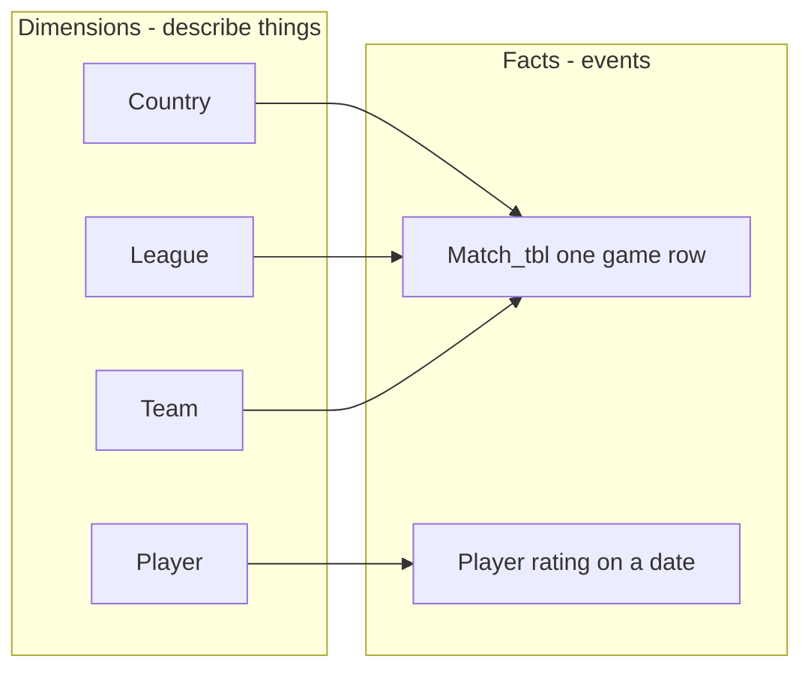

**Why this matters on the slide**  
When you tell the story “I have both sides,” graders hear you understand **database design**, not only `SELECT *`.

## What to say (~45 seconds)

Personal reason first (15 sec), then: “Because I know soccer, my questions make sense—like clean sheets and league scoring—and the tables support them.”

---

# Slide 4 — ER diagram (entity-relationship diagram)

## What you see

A picture of **7 boxes** (tables) with **arrows** between them.  
Subtitle: **Initial and final use the same 7 tables** — you did not change the plan at the end; you built what you designed.

## Diagram: same as slide (Mermaid version)

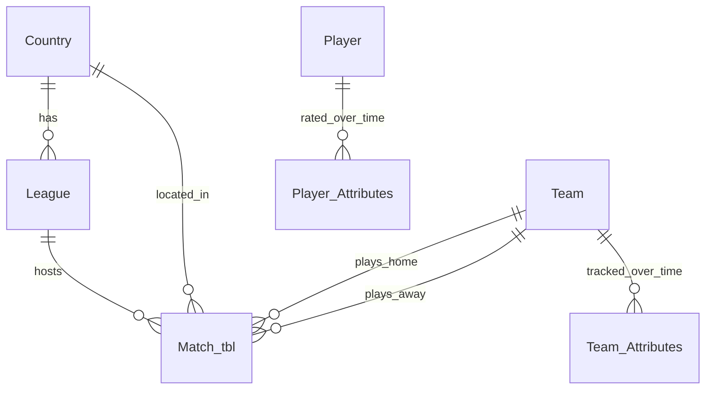

## Each table explained like a character in a story

### Country

- **One row** = one nation (England, Spain, …).  
- **Primary key (`id`)** = unique ID number nobody else shares (like a student ID).

### League

- **One row** = one competition (Premier League, Bundesliga, …).  
- **`country_id`** = **foreign key** — points to which country owns that league.  
  - *Analogy:* League carries a pointer that says “I belong to England.”

### Match_tbl

- **One row** = **one finished game**.  
- Stores **home goals**, **away goals**, **date**, betting odds, lineup IDs.  
- This is the **busiest** table—most business questions touch it.

### Team

- **One row** = one club (long name: “Manchester United”).  
- Linked to matches by `home_team_api_id` and `away_team_api_id`.

### Team_Attributes / Player_Attributes

- **Many rows per team/player** — different **dates** (skill changes over time).  
- Like measuring height/weight every month—not just once.

## Solid vs dashed arrows on your PNG slide

| Arrow style | Meaning in plain English |
|-------------|-------------------------|
| **Solid** | PostgreSQL **enforces** the link (cannot insert a league with a fake `country_id`). |
| **Dashed** | Makes sense logically, but maybe **not enforced** (source data messy). |

## Views (not drawn—mention on camera)

A **view** is a **saved SELECT** that looks like a table:

- `league_match_summary_view` — average goals per league (shortcut).  
- `match_context_view` — match row with **names** instead of only ID numbers.

*Analogy:* View = a bookmark to a complicated report you run often.

## What to say (~1.5 minutes)

Start at Country → League → Match_tbl down the middle. Point left to Team, right to Player. Say views sit on top for easy reading.

---

# Slide 5 — Hardest part

## Bullets — what was actually hard

1. **Moving data** between formats without breaking types.  
2. **Match_tbl** has tons of columns—easy to join the wrong ID.  
3. **Hard SQL** (streaks, windows) for advanced questions.  
4. **Foreign keys**—some bad rows in Kaggle data.  
5. **30 questions** must match real columns.

## Diagram: why wrong joins fool you

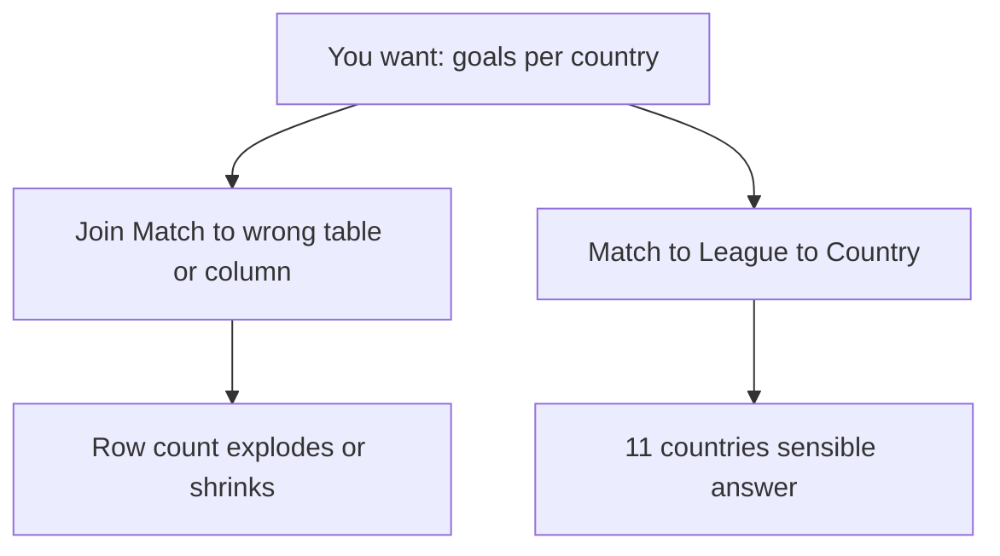

**Example you can say on camera:**  
“If I join matches to teams twice by mistake, one game might become many duplicate rows—then my average goals would be **wrong** even though the SQL runs.”

## What to say (~1 minute)

Pick **one** real struggle (load error, or a streak query). Explain it in one sentence + how you fixed it.

---

# Slide 6 — What I learned

## Ideas in student-friendly language

| Slide bullet | What it really taught you |
|--------------|---------------------------|
| Design first | Draw the map before driving—ERD saves time. |
| INNER vs LEFT JOIN | INNER = only matches that exist on **both** sides; LEFT = keep all from left even if right missing. |
| Views | Store a recipe once; reuse forever. |
| Indexes | Like a book index—faster lookup on huge tables. |
| Window functions | Compare each row to **previous** rows in a group (streaks). |

## Diagram: INNER vs LEFT JOIN

```mermaid
flowchart TB
  subgraph inner [INNER JOIN - strict guest list]
    A1[Match row] --- B1[League row must exist]
    A2[Match with bad league_id] x[Thrown out]
  end
  subgraph left [LEFT JOIN - keep all matches]
    C1[Every match row kept]
    C2[Missing league shows NULL]
  end
```

## What to say (~1 minute)

Connect to class topics: normalization (organizing tables), SQL (joins), physical design (indexes for grad).

---

# Slide 7 — SQL confidence now

## Honest skill ladder

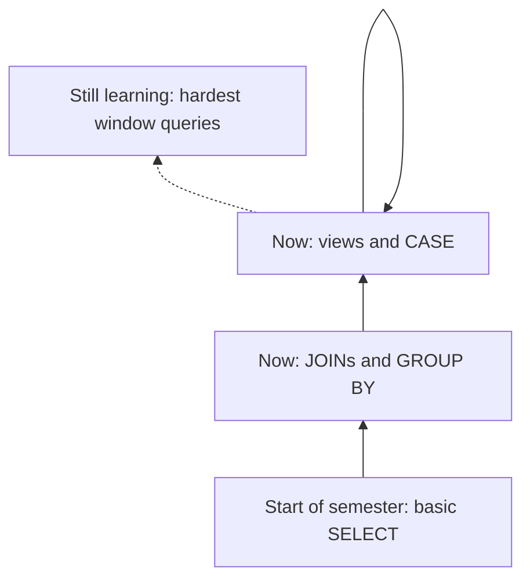

**Debugging trick (say this clearly):**  
After each JOIN, run `SELECT COUNT(*)`. If the number jumps from 26,000 to 200,000, something duplicated—you joined too loosely.

**EXPLAIN** = ask PostgreSQL “how will you run this?”—like peeking at the engine, not just the speedometer.

## What to say (~45 seconds)

“I’m not perfect, but I can build real queries, save them as views, and debug when counts look wrong.”

---

# Slide 8 — What I would do next

## Future improvements (why each matters)

| Idea | Simple benefit |
|------|----------------|
| More foreign keys + CHECK rules | Stop garbage rows (negative goals). |
| Summary tables / materialized views | Dashboards load faster. |
| More indexes | Less waiting on big queries. |
| Data quality report | Trust your numbers before presenting to a boss. |
| Tableau / Power BI | Coaches and marketers click charts—not SQL. |

## Diagram: today vs “more time”


## What to say (~45 seconds)

Pick two items and tie to business: “Faster, cleaner data means decisions sooner.”

---

# Slide 9 — DEMO: Tables + row counts

## Numbers on the slide

| Table | Rows | Why care? |
|-------|------|-----------|
| Country | 11 | Small lookup—names of nations |
| League | 11 | Links country → competition |
| Team | 299 | All clubs you might recognize |
| Match_tbl | 25,979 | Every game—heart of analytics |
| **All 7 tables** | **222,796** | Shows project size |

## Diagram: parent → child (foreign keys)

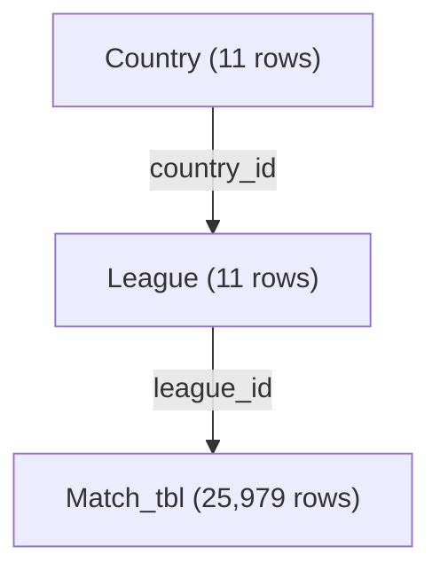

**Foreign key rule in plain English:**  
The child row stores the parent’s ID. A match’s `league_id` must match a real `League.id`—like a test answer key must match a real question number.

## Live demo steps in DBeaver

1. Connect to database with `soccer_proj`.  
2. Expand **Schemas → soccer_proj → Tables**.  
3. Run:

```sql
SELECT COUNT(*) FROM soccer_proj."Country";
SELECT COUNT(*) FROM soccer_proj."League";
SELECT COUNT(*) FROM soccer_proj."Team";
SELECT COUNT(*) FROM soccer_proj."Match_tbl";
```

4. Optional peek:

```sql
SELECT league_id, country_id, home_team_goal, away_team_goal
FROM soccer_proj."Match_tbl"
LIMIT 5;
```

## What to say (~1 minute)

“This proves data loaded. Country is small; Match_tbl is huge—that’s where goals live.”

---

# Slide 10 — DEMO: Intermediate query (Q16)

## Question in everyday English

**Which countries have the highest average total goals per game** (home goals + away goals), averaged across all matches in that country’s leagues?

## SQL on the slide

```sql
SELECT c.name AS country,
  AVG((m.home_team_goal + m.away_team_goal)::numeric) AS avg_goals_per_match
FROM soccer_proj."Match_tbl" m
JOIN soccer_proj."League" l ON l.id = m.league_id
JOIN soccer_proj."Country" c ON c.id = l.country_id
GROUP BY c.name
ORDER BY avg_goals_per_match DESC;
```

## Diagram: path of the data (Q16)

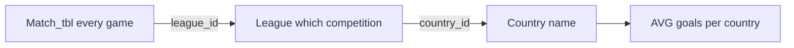

## Keyword cheat sheet (11th–12th grade)

| SQL piece | What it does | Analogy |
|-----------|--------------|---------|
| `SELECT` | Choose columns to show | Pick which columns on a report |
| `FROM Match_tbl` | Start with games | Open the games notebook first |
| `JOIN League` | Attach league info | Staple league label to each game |
| `JOIN Country` | Attach country name | Staple country label after league |
| `home_team_goal + away_team_goal` | Total goals that game | Home score + away score |
| `AVG(...)` | Average | Average test score across games |
| `GROUP BY c.name` | One result row per country | Collapse all Spain games into one Spain row |
| `ORDER BY ... DESC` | Highest first | Leaderboard top to bottom |
| `::numeric` | Decimal math | Calculator mode that allows fractions |

## Why this is “intermediate”

- **Three tables** connected correctly.  
- **GROUP BY** + **AVG** (aggregation).  
- No `CASE`, no subquery, no window—middle difficulty.

## What to say (~1 minute)

Read the question, trace the diagram left-to-right, run SQL in tab `demo1`.

---

# Slide 11 — DEMO Q16 — Query results (screenshot)

## What your picture shows

- Top: SQL from slide 10.  
- Bottom: grid with **11 rows** (all countries).  
- **Netherlands** ~**3.08** goals per match on top (in your run).  
- Sticky note: **emmanart / Emmanuel Arthur** for ID.

## Diagram: reading the leaderboard

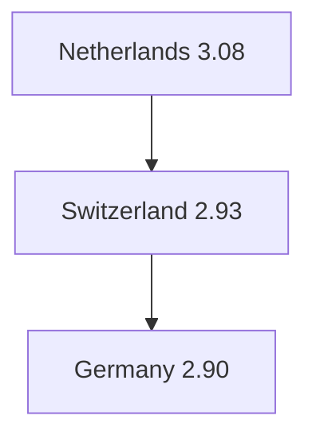

**Important idea:**  
Higher average does **not** automatically mean “best league”—it means **more goals per game on average** in that country’s data slice (exciting games vs defensive games).

## Note about `spy` schema in the same screenshot

Your navigator may show **both** `spy` (homework database) and `soccer_proj` (final project). The demo query uses **`soccer_proj`**. Say that out loud so the grader is not confused.

## What to say (~30 seconds)

“Here are real results—eleven countries, Netherlands highest average goals per match in this dataset.”

---

# Slide 12 — DEMO: Advanced query (Q18)

## Question in everyday English

**Which teams kept the most clean sheets?**  
A **clean sheet** = the other team scored **0** goals against you (great defense).

## SQL on the slide

```sql
SELECT t.team_long_name,
  SUM(CASE WHEN m.home_team_api_id = t.team_api_id AND m.away_team_goal = 0 THEN 1 ELSE 0 END
     + CASE WHEN m.away_team_api_id = t.team_api_id AND m.home_team_goal = 0 THEN 1 ELSE 0 END) AS clean_sheets
FROM soccer_proj."Team" t
JOIN soccer_proj."Match_tbl" m
  ON m.home_team_api_id = t.team_api_id OR m.away_team_api_id = t.team_api_id
GROUP BY t.team_long_name
ORDER BY clean_sheets DESC
LIMIT 30;
```

## Diagram: one team, many matches (OR join)

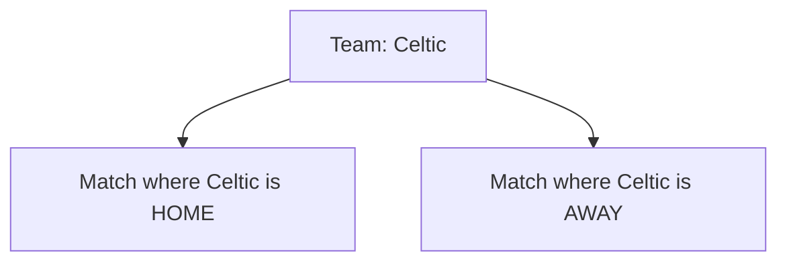

**Why OR in the JOIN?**  
A team appears in a match **either** as home **or** as away. You need **both** kinds to count all clean sheets.

## Diagram: how CASE adds 1 for a clean sheet

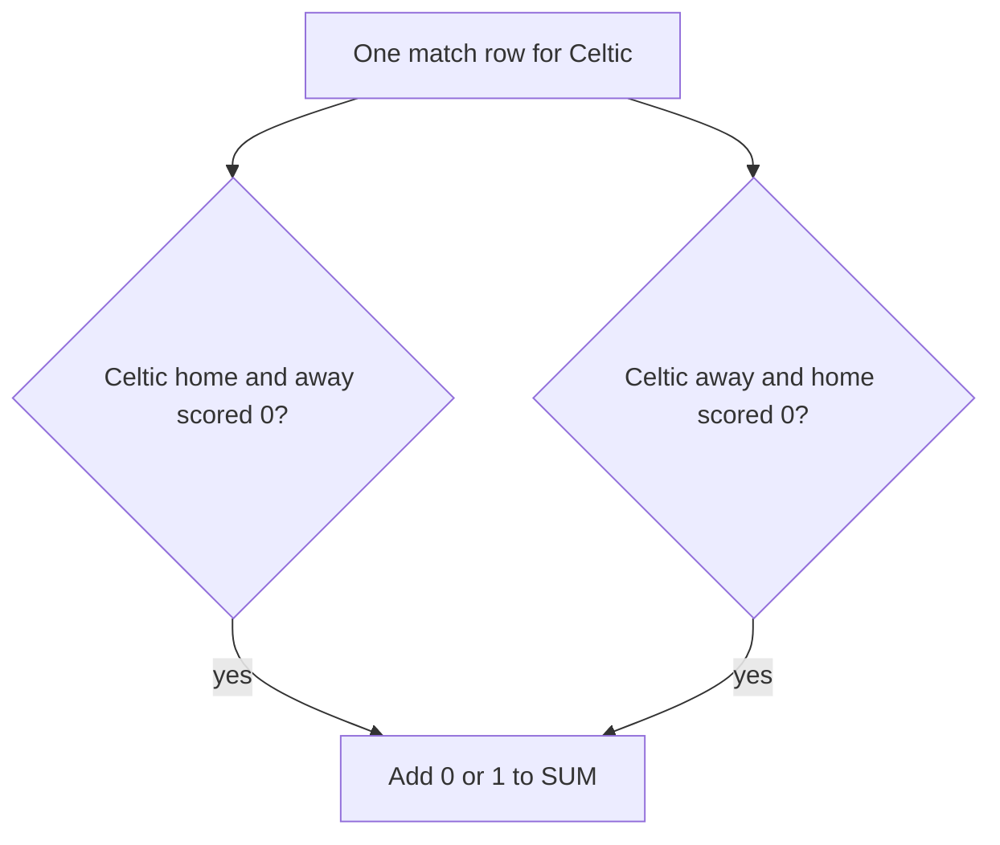

- First `CASE`: checks **home** clean sheet.  
- Second `CASE`: checks **away** clean sheet.  
- `SUM` adds them over **all** Celtic games.

## Why this is “advanced”

- **OR** in a join (trickier than AND).  
- **Conditional counting** with `CASE` inside `SUM`.  
- Still one `GROUP BY`—but logic is denser than Q16.

## What to say (~1 minute)

Define clean sheet in one sentence, show OR join idea with hands (home vs away), run `demo2`.

---

# Slide 13 — DEMO Q18 — Query results (screenshot)

## Top of your leaderboard (example)

| Rank | Team | clean_sheets |
|------|------|----------------|
| 1 | Celtic | 153 |
| 2 | FC Barcelona | 140 |
| 3 | Manchester United | 133 |

## Diagram: defensive strength story

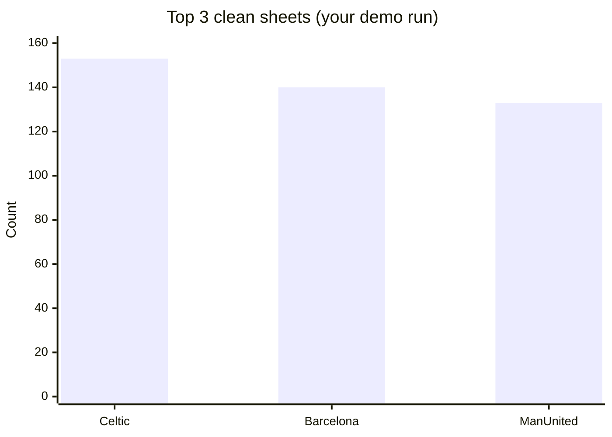

**Caution (smart extra point for Q&A):**  
Teams play different numbers of games. A fairer metric might be `clean_sheets / games_played`. You can mention that if asked—it shows critical thinking.

## What to say (~30 seconds)

“Celtic leads in clean sheets in this historical slice—Barcelona and Manchester United follow. That’s a defensive KPI clubs track.”

---

# Slide 14 — Business applications

## Each bullet translated

| On slide | Real-world who cares |
|----------|----------------------|
| Club / league operations | Coaches, sporting directors, performance staff |
| Media / broadcasting | TV planners, journalists, social media stats |
| Betting / risk | Odds analysts (with legal rules) |
| Player attributes ≈ HR ratings | Explain databases to non-soccer adults |
| Retail / finance parallel | Same pattern: regions + sales over time |

## Diagram: same pattern everywhere

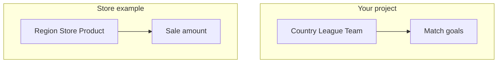

**Star schema idea (simple):**  
Skinny tables for categories, fat fact table for events—fast questions.

## Tie demos to this slide

- **Q16** → media/market comparison (high-scoring countries).  
- **Q18** → club operations (defense ranking).

## What to say (~45 seconds)

Pick **two** bullets; link directly to your two demo queries.

---

# Slide 15 — Thank you

## On screen

- **Questions?**  
- Reminder: **Deliverable 4 write-up + video link** in submission.

## Checklist before you submit

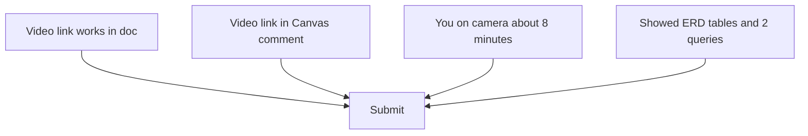

## What to say (~15 seconds)

“Thank you—questions welcome. The full write-up and video link are in my Deliverable 4 document.”

---

# Appendix A — 8-minute pacing (practice clock)

| Slide | Topic | Minutes |
|-------|--------|---------|
| 1 | Title | 0:30 |
| 2 | Dataset | 1:00 |
| 3 | Why chosen | 0:45 |
| 4 | ERD | 1:30 |
| 5 | Hardest | 1:00 |
| 6 | Learned | 1:00 |
| 7 | Confidence | 0:45 |
| 8 | Next steps | 0:45 |
| 9 | Table counts | 1:00 |
| 10–11 | Q16 + results | 1:30 |
| 12–13 | Q18 + results | 1:30 |
| 14 | Business | 0:45 |
| 15 | Thanks | 0:15 |
| **Total** | | **~8:00** |

```mermaid
gantt
    title Practice timeline (8 min)
    dateFormat X
    axisFormat %M:%S
    section Intro
    Title           :0, 30s
    Dataset         :30s, 60s
    Why             :90s, 45s
    section Design
    ERD             :135s, 90s
    section Reflection
    Hard Learn Conf Next :225s, 210s
    section Demo
    Tables          :435s, 60s
    Q16             :495s, 90s
    Q18             :585s, 90s
    section Close
    Business Thanks :675s, 60s
```

---

# Appendix B — Glossary (words on the slides)

| Word | Meaning |
|------|---------|
| **Schema** | Folder for related tables (`soccer_proj`). |
| **Table** | Grid of rows and columns about one topic. |
| **Primary key** | Unique ID for a row in that table. |
| **Foreign key** | Column that stores another table’s ID to link rows. |
| **JOIN** | Combine two tables on matching IDs. |
| **INNER JOIN** | Keep only rows that match on both sides. |
| **GROUP BY** | Squish many rows into groups (per country, per team). |
| **AVG / SUM** | Average or total of a column in each group. |
| **CASE** | If/else inside SQL. |
| **View** | Saved query pretending to be a table. |
| **Clean sheet** | Opponent scored 0 against you. |
| **Row count** | `SELECT COUNT(*)` — how many rows exist. |

---

# Appendix C — Files in this repo

| File | Purpose |
|------|---------|
| `FinalProject/presentation/Deliverable4_Presentation-emmanart.pptx` | Slides for video |
| `FinalProject/presentation/Deliverable4_Presentation_Deep_Dive-emmanart.md` | This guide |
| `FinalProject/deliverables/Deliverable4_Demo_SQL_Handout.txt` | SQL only |
| `FinalProject/presentation/demo_q16_results.png` / `demo_q18_results.png` | Screenshot slides |
| `FinalProject/demo/Demo_Q16_Q18_Answers.txt` | Demo script notes |
| `FinalProject/scripts/_build_deliverable4_pptx.py` | Rebuilds PowerPoint |

---

*End of guide — Emmanuel Arthur (emmanart), Spring 2026. Diagrams render in GitHub, VS Code (Mermaid), and many Markdown viewers.*
